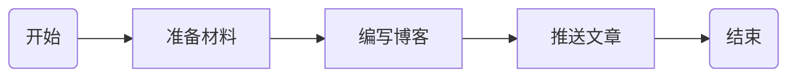
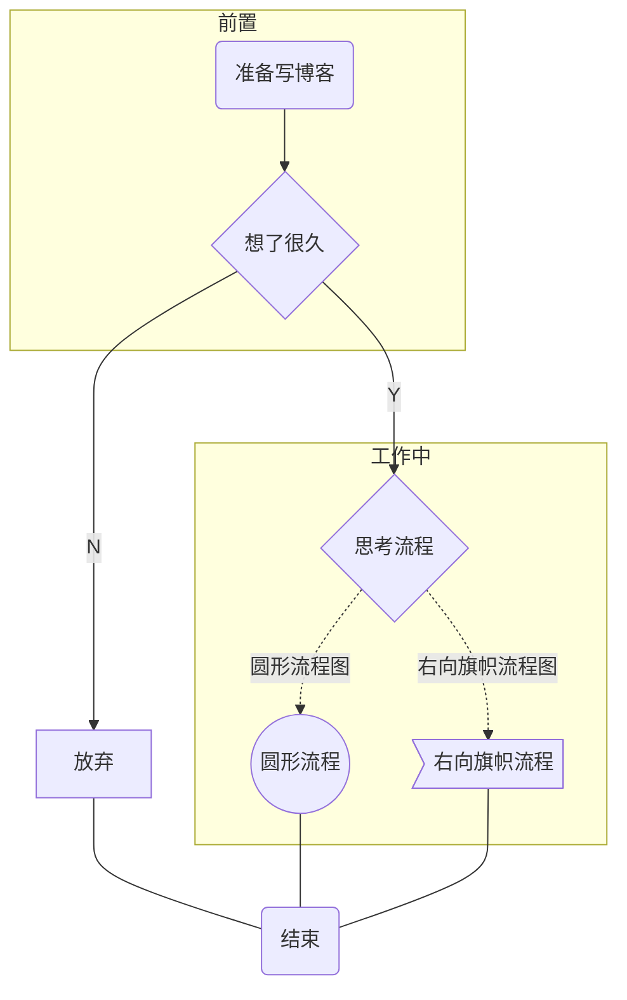
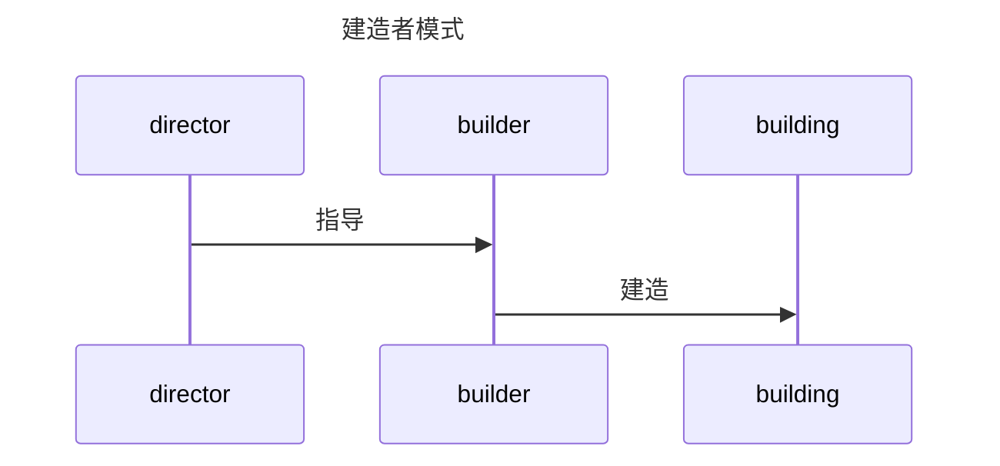
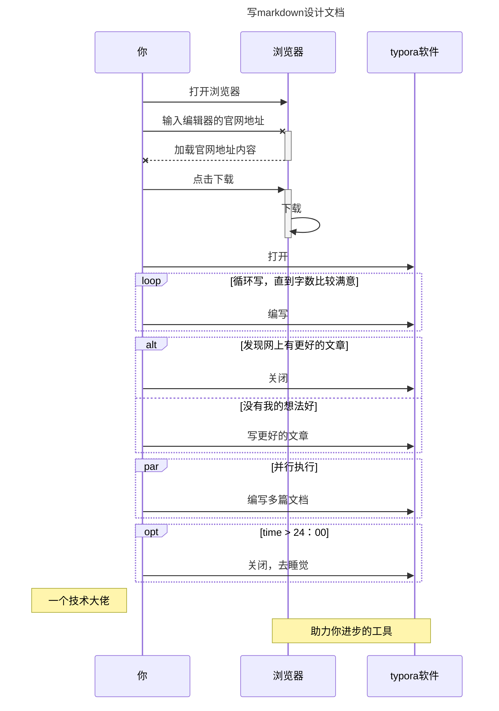
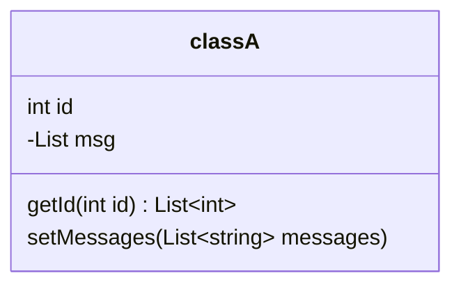
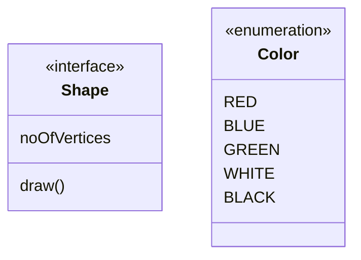
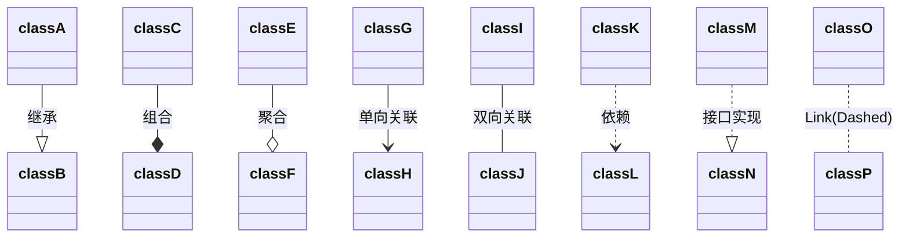
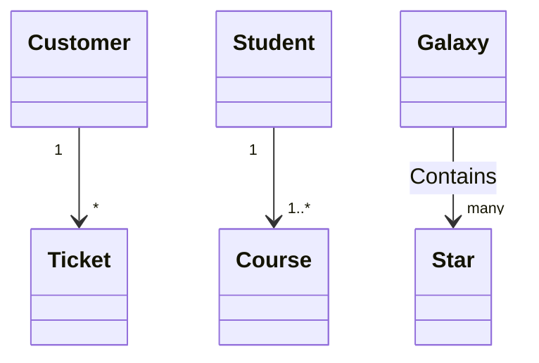

```mermaid
graph LR;
START(开始)-->准备材料-->编写博客-->推送文章-->END(结束)
```

```mermaid
graph TB;
subgraph 前置
A(准备写博客)-->B{想了很久}
end
B--N-->C[放弃]
B--Y-->F{思考流程}
subgraph 工作中
F-.圆形流程图.->J((圆形流程))
F-.右向旗帜流程图.->H>右向旗帜流程]
end
H---I(测结束)
C---I(结束)
J---I(结束)
```

```mermaid
sequenceDiagram
Title: 建造者模式

director->>builder: 指导
builder ->> building: 建造
```

```mermaid
sequenceDiagram
Title: 写markdown设计文档
participant auther as 你
participant brower as 浏览器
participant soft as typora软件
auther->>brower: 打开浏览器
auther -x +brower: 输入编辑器的官网地址
brower --x -auther: 加载官网地址内容

auther ->> +brower: 点击下载
brower ->> -brower: 下载

auther ->> soft: 打开
loop 循环写，直到字数比较满意
auther ->> soft: 编写
end

alt 发现网上有更好的文章
auther ->> soft: 关闭
else 没有我的想法好
auther ->> soft: 写更好的文章
end

par 并行执行
auther ->> soft : 编写多篇文档
end

opt time > 24：00
auther ->> soft : 关闭，去睡觉
end

Note left of auther : 一个技术大佬
Note over brower,soft : 助力你进步的工具
```

```mermaid
classDiagram

class classA{
int	id
-List<String> msg
getId(int id) List~int~
}
classA : setMessages(List~string~ messages)
```

```mermaid
classDiagram
class Shape{
    <<interface>>
    noOfVertices
    draw()
}
class Color{
    <<enumeration>>
    RED
    BLUE
    GREEN
    WHITE
    BLACK
}
```

```mermaid
classDiagram


    classA --|> classB : 继承
    classC --* classD : 组合
    classE --o classF : 聚合
    classG --> classH : 单向关联
    classI -- classJ : 双向关联
    classK ..> classL : 依赖
    classM ..|> classN : 接口实现
    classO .. classP : Link(Dashed)

```

```mermaid
   
classDiagram
    Customer "1" --> "*" Ticket
    Student "1" --> "1..*" Course
    Galaxy --> "many" Star : Contains
```
